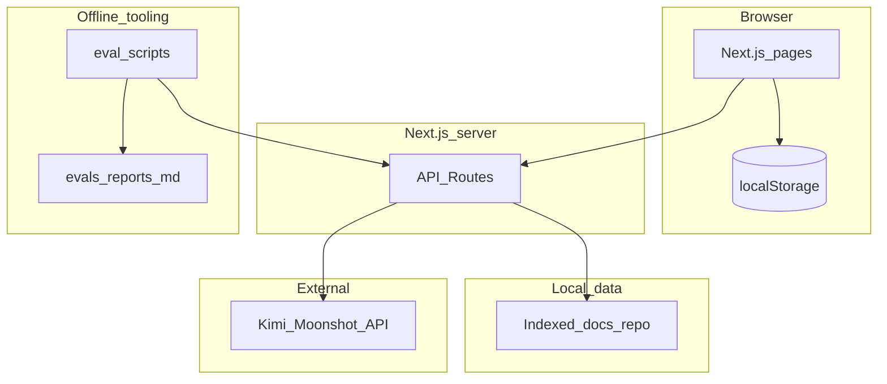
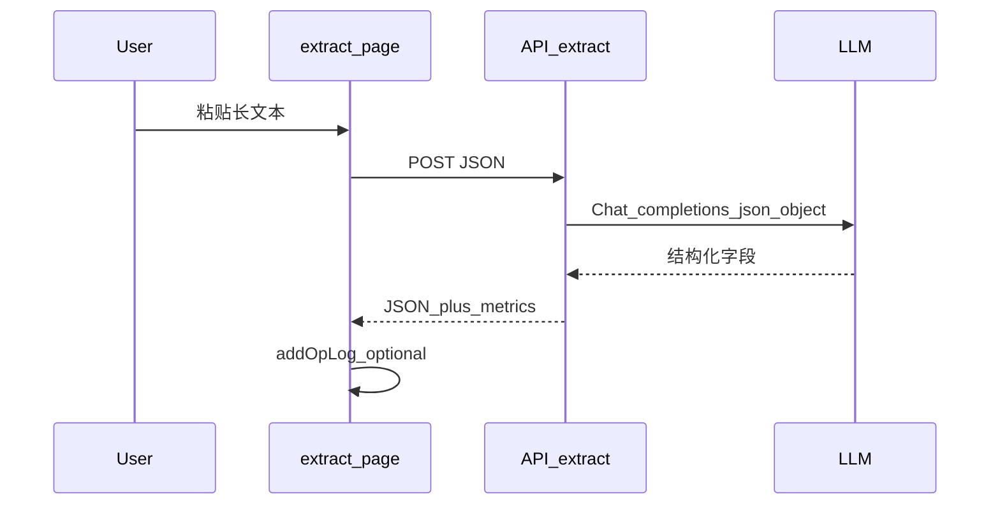
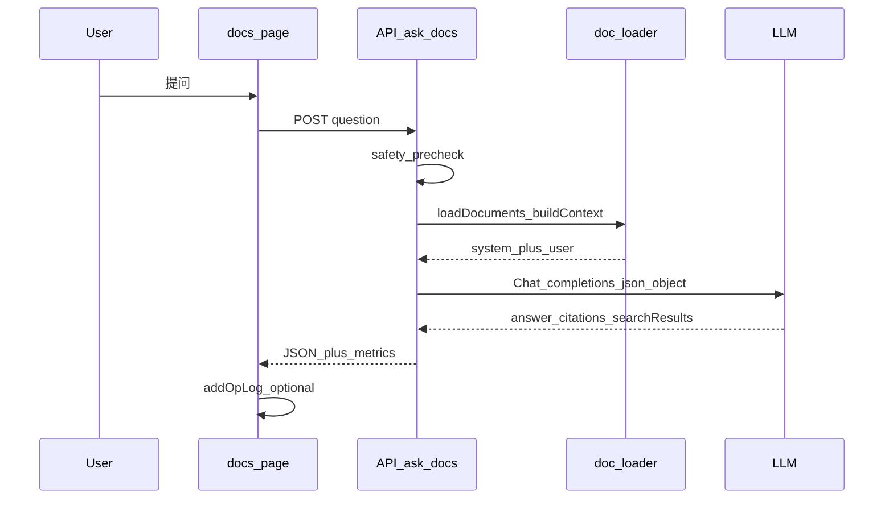
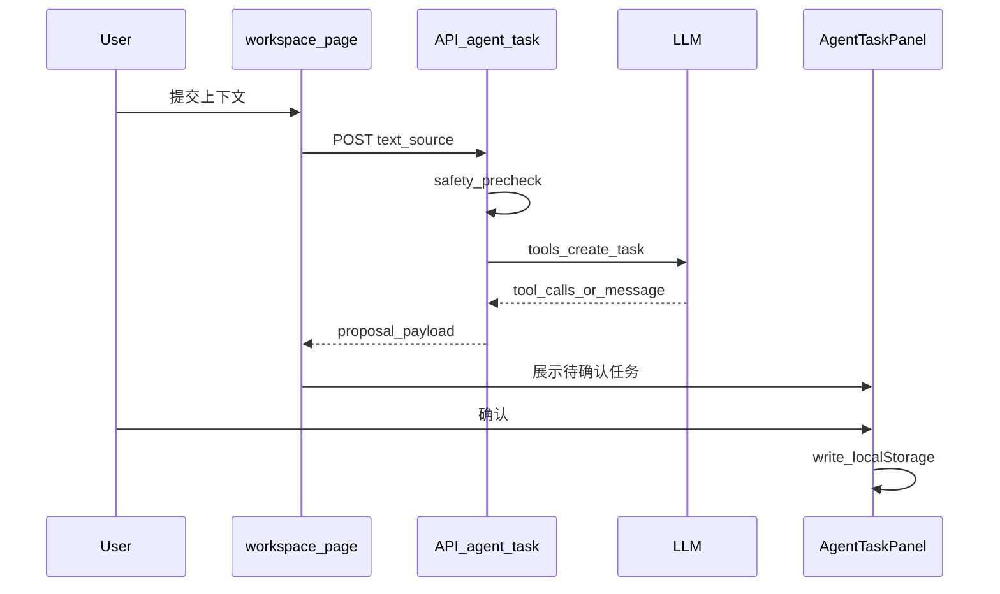

# 系统架构与数据流

本文档配合根目录 [README.md](../README.md) 的 **System design** 小节，使用 Mermaid 描述组件关系与三条主链路。栈说明：**Next.js App Router** + **Kimi（Moonshot）Chat Completions**；文档问答将**本地索引文档**拼入 system prompt，与 OpenAI Responses `file_search` 不是同一路径。

---

## 图 1：系统架构

| 组件 | 路径或说明 |
|------|------------|
| 页面 | `src/app/`：`/`、`/prompt`、`/extract`、`/docs`、`/workspace`、`/ops` |
| API | `src/app/api/`：`generate`、`extract`、`ask-docs`、`agent-task` |
| localStorage | 任务列表、Ops 日志（如 `ops-store`、`task-store`） |
| 文档索引 | `scripts/setup-doc-index.mjs` 等生成的索引，供 `ask-docs` 读取 |
| 外部 API | 仅 **Kimi（Moonshot）**；主对话与安全 JSON 分类均走同一凭证（见 [domestic-llm.md](domestic-llm.md)） |
| Function tool | `create_task`（`agent-task` 路由），落地需前端审批 |
| Eval | `scripts/run-evals.mjs`、`scripts/run-security-evals.mjs` |
| Ops 记录 | 成功请求后前端写入，供 `/ops` 展示 |

---

## 图 2：关键数据流

### Extract 流

### Docs QA 流

### Task approval 流

---

## 页面与 API 对照

| 用户场景 | 页面 | API |
|----------|------|-----|
| 对比 prompt | `/prompt` | `POST /api/generate` |
| 结构化抽取 | `/extract` | `POST /api/extract` |
| 带引用问答 | `/docs` | `POST /api/ask-docs` |
| 审批式任务 | `/workspace` | `POST /api/agent-task` + 前端确认 |
| 成本与延迟 | `/ops` | （读 localStorage，无单独聚合 API） |

可选：将 Mermaid 导出为 PNG 放入 `assets/`，便于幻灯片使用；注意与本文档同步更新。
