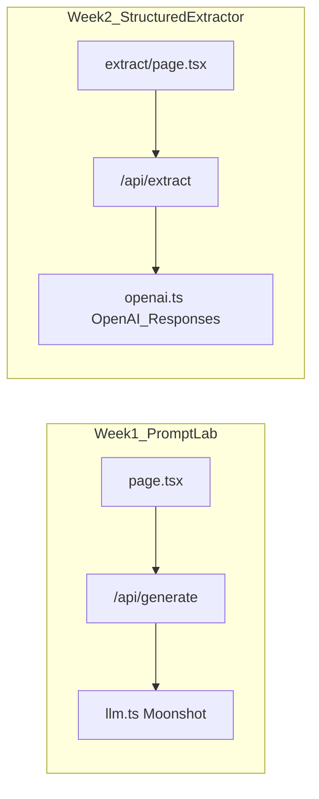

# Week 2：Structured Extractor v1 实现计划

## 关键结论（提供商）

- 文档中的 `[openai.responses.parse](https://platform.openai.com/docs/guides/structured-outputs?lang=javascript)` + `[zodTextFormat](https://github.com/openai/openai-node)` 属于 **OpenAI Responses API**，与 Week 1 使用的 **Moonshot Chat Completions** 不是同一条 HTTP 能力；Moonshot 文档目前写明的是 `response_format: {"type":"json_object"}` 等 Chat 参数，**不能保证** `responses` 端点可用。
- 因此：**Week 2 抽取接口使用 OpenAI 官方 endpoint + `OPENAI_API_KEY`**；Week 1 仍使用现有 `[src/lib/llm.ts](src/lib/llm.ts)` 的 `MOONSHOT_*`。在 `[README.md](README.md)` 的 Week 2 小节中写清两套变量，避免混淆。




## 0. Preflight（执行前验证）

- 确认 `node_modules/openai` 实际版本 >= 6.x 且包含 `openai/helpers/zod` 导出（`zodTextFormat`、`zodResponseFormat`）。
- 确认 `tsconfig.json` 的 `paths` 已覆盖 `@/schemas/*`（Week 1 已有 `@/*` 映射则无需改动）。
- 读取当前 `.env`，了解已有 Moonshot 变量，以便后续追加 OpenAI 变量时不冲突。

## 1. 依赖

- 执行：`npm install zod`（与文档周一一致；若遇 `zodTextFormat` 与 Zod 主版本兼容问题，再固定为 `zod@^3`，当前 `openai@^6` 已较新，一般可配合 Zod 3）。

## 2. 新增/修改的源码（与文档目录一致）

- `**src/schemas/extraction.ts**` — 直接采用文档中的 `ActionItemSchema` / `RiskSchema` / `ExtractionSchema` 与 `ExtractionResult` 类型。
- `**src/types/extraction.ts**` — 文档目录要求存在：写一行 `export type { ExtractionResult } from "@/schemas/extraction"`，避免类型重复定义。
- `**src/lib/openai.ts**` — 新建：`new OpenAI({ apiKey: process.env.OPENAI_API_KEY })`，默认 `baseURL` 为官方（不设则用 SDK 默认）；导出 `openai`、`DEFAULT_MODEL`（`process.env.OPENAI_MODEL || "gpt-4o-mini"`，选用支持 Structured Outputs 的模型）。
- `**src/app/api/extract/route.ts**` — 按文档骨架实现：
  - `POST` 读 `text`，校验非空。
  - 沿用 Week 1 的 **20000 字符** 上限以防超长 → 400。
  - 校验 `OPENAI_API_KEY` 缺失 → **401** + "请配置 OPENAI_API_KEY"。
  - 调用 `openai.responses.parse` + `zodTextFormat(ExtractionSchema, "extraction_result")`。
  - **检测 refusal**：若 `response.output_parsed` 为 null 且存在 refusal，返回 **422** + 拒答原因（Structured Outputs 支持 explicit refusal 检测）。
  - 通用异常 → **500** + "结构化抽取失败，请稍后重试。"
  - 返回 `{ result: response.output_parsed, model }`。
- `**src/components/ExtractionResultCard.tsx`**（**重命名**，避免与 `ExtractionResult` 类型同名冲突；文档骨架原名 `ExtractionResult`，page.tsx 中不再需要 `as ExtractionResultView` 别名）：
  - 四块卡片渲染：简要总结 / 行动项 / 风险 / 待确认问题。
  - `severity` 字段加 **颜色 badge**：`low` 绿、`medium` 黄、`high` 红，提升可读性。
- `**src/components/JsonPreview.tsx`** — `JSON.stringify` 预览 + **「复制 JSON」** 按钮（`navigator.clipboard` + 状态反馈）。
- `**src/app/extract/page.tsx`** — 按文档骨架：
  - `textarea`、开始抽取/清空、loading/error。
  - 双栏布局：左 `ExtractionResultCard` + 右 `JsonPreview`。
  - **「复制摘要」** 按钮（文档周六可选功能之一）。
  - **「导出 Markdown」** 按钮（文档周六可选功能之二；将 `ExtractionResult` 转为 markdown 字符串并触发下载/复制）。

## 3. 环境配置

- 更新 `.env`（或新建 `.env.example`）：在已有 `MOONSHOT`_* 变量下方追加：

```
  OPENAI_API_KEY=你的_openai_api_key
  OPENAI_MODEL=gpt-4o-mini
  

```

## 4. Week 1 衔接（最小改动）

- `src/lib/llm.ts`：保持 Moonshot 与 `generateText` 不变，**不**与 `openai.ts` 混用客户端，以免 baseURL 串台。
- `src/app/api/generate/route.ts`：无需改逻辑。

## 5. 导航与可发现性（小改动）

- 在 `src/app/layout.tsx` 或两个页面顶部增加简短导航链接：`/`（Prompt Lab v1）与 `/extract`（Structured Extractor v1），避免新页面孤立。

## 6. 文档与笔记（文档要求的全部产出）

- 新建 `notes/week2-day1.md`：按文档「周一」写 5 句话（结构化输出是什么、为何适合业务、为何早用 schema）。
- 新建 `notes/week2-samples.md`：收录文档「测试输入样例」三节原文，满足周六「至少 3 条测试输入」的可复用记录。
- **新建 `notes/week2-failure-cases.md`**：按文档「周日」要求，写 1 个失败案例——哪种输入让 actionItems 抽取不稳定、哪种风险等级判断偏主观、下周准备怎么改。
- 更新 `docs/README.md`：增加 **Week 02** 链接到 `docs/week-02/README.md`。
- 更新根 `README.md`：
  - 增加 Week 2 小节（嵌入文档中的「Week 2 README 模板」：目标、核心能力、为何重要、复盘占位）。
  - 写明两套环境变量：**Week 1** `MOONSHOT_`*；**Week 2** `OPENAI_API_KEY`、`OPENAI_MODEL`。

## 7. 验证方式（实现后由你本地执行）

- `npm run build` 通过（无 TS/lint 错误）。
- 配置 `OPENAI_API_KEY` 后访问 `/extract`，用文档样例 1 跑一次：左侧四块卡片（含 severity 颜色）、右侧 JSON、复制 JSON/复制摘要/导出 Markdown 均可用；模糊样例 3 观察 `actionItems` / `risks` / `openQuestions` 行为。

## 风险与说明（写在 README 即可）

- 若仅有 Moonshot Key、无 OpenAI Key，**Week 2 页面无法工作**；若未来需要「仅 Moonshot」，需另开任务：用 Chat + `json_object` + `ExtractionSchema.safeParse` 替代 `responses.parse`（与官方 Structured Outputs 严格程度不同）。

