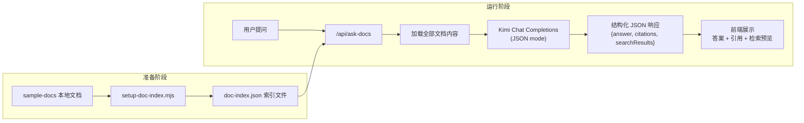

# Doc QA v1 -- 基于 Moonshot/Kimi 的适配实现

## 1. 文档分析

Week 3 文档要求实现 **Doc QA v1**：把 3-5 份本地文档接入问答系统，返回 **答案 + 引用来源 + 检索结果预览**。

文档假设使用 **OpenAI Responses API + `file_search` + vector store**，但本项目的实际 LLM 是 **Moonshot/Kimi (kimi-k2.5)**。

### 文档的 5 项完成标准

- 本地有 `sample-docs/` 放 3-5 份样例文档
- 能跑脚本把文档建立索引
- 网页里能输入问题并返回答案
- 页面能显示引用文件名
- 页面能显示检索结果预览

## 2. 项目现状 vs 文档要求的差异


| 维度      | 文档假设 (OpenAI)                              | 项目实际 (Moonshot/Kimi)                    |
| ------- | ------------------------------------------ | --------------------------------------- |
| LLM 客户端 | `openai.responses.create`                  | `openai.chat.completions.create` (兼容模式) |
| 文件检索    | `file_search` built-in tool + vector store | **无此功能**                                |
| 引用标注    | response `annotations` 自动带文件引用             | **无此功能**                                |
| 文件上传    | `purpose: "assistants"`                    | `purpose: "file-extract"` (内容提取)        |
| 上下文窗口   | -                                          | 256K tokens (足够放入 3-5 份小文档)             |
| JSON 模式 | -                                          | 支持 `response_format: json_object`       |


## 3. 适配架构

核心思路：**全上下文注入 + JSON 结构化输出**




**与 OpenAI 方案的关键差异：**

- 不使用 vector store，改为本地读取文档 + 全量注入到 system message
- 不使用 `file_search` tool，改为在 prompt 中指示模型基于文档回答并输出 JSON
- 不依赖 `annotations` 自动引用，改为让模型在 JSON 中显式输出引用信息
- 使用 Kimi 已有的 `response_format: json_object` (Week 2 已验证可用)

## 4. 具体实现

### 4.1 样例文档 -- `sample-docs/`

创建 3 份文档，内容与文档建议一致：

- `sample-docs/product.md` -- 产品功能说明
- `sample-docs/roadmap.md` -- 路线图
- `sample-docs/faq.txt` -- FAQ

### 4.2 索引脚本 -- `scripts/setup-doc-index.mjs`

读取 `sample-docs/` 下所有文件，生成 `doc-index.json`：

```javascript
// doc-index.json 结构
{
  "documents": [
    { "filename": "product.md", "content": "...", "charCount": 123 },
    { "filename": "roadmap.md", "content": "...", "charCount": 80 },
    { "filename": "faq.txt", "content": "...", "charCount": 200 }
  ],
  "createdAt": "2026-03-27T..."
}
```

不需要 OpenAI API Key，不需要 vector store。纯本地操作。

### 4.3 类型定义 -- [src/types/doc-qa.ts](src/types/doc-qa.ts) (新建)

与文档一致，复用 `Citation`, `SearchResultItem`, `DocQAResponse` 类型。

### 4.4 文档加载器 -- [src/lib/doc-loader.ts](src/lib/doc-loader.ts) (新建)

```typescript
// 读取 doc-index.json，返回格式化的文档内容
// 用于 API route 注入到 system message
```

### 4.5 API 路由 -- [src/app/api/ask-docs/route.ts](src/app/api/ask-docs/route.ts) (新建)

关键适配点，使用 Kimi Chat Completions + JSON mode：

- System prompt 包含所有文档内容（带文件名标记）
- 指示模型输出 JSON：`{ answer, citations: [{filename, quote}], searchResults: [{filename, relevance, text}] }`
- 使用 `response_format: { type: "json_object" }` 保证输出格式
- 复用 [src/lib/llm.ts](src/lib/llm.ts) 的 `openai` 客户端和 `DEFAULT_MODEL`

### 4.6 前端组件 (新建)

与文档结构一致：

- `src/components/DocAnswerCard.tsx` -- 显示答案 + 模型名
- `src/components/CitationList.tsx` -- 显示引用来源列表
- `src/components/SearchResultsPreview.tsx` -- 显示检索结果预览

### 4.7 页面 -- [src/app/docs/page.tsx](src/app/docs/page.tsx) (新建)

与文档结构一致：textarea 输入 + 提问/清空按钮 + 答案/引用/检索预览三栏展示。

### 4.8 导航更新 -- [src/components/AppNav.tsx](src/components/AppNav.tsx)

添加 "Doc QA v1" 导航链接指向 `/docs`。

### 4.9 配置更新

- `.env.example` 无需新增环境变量（复用 `MOONSHOT_*`）
- `README.md` 增加 Week 3 说明

## 5. 优化空间分析

### 当前方案的局限

- **扩展性**：全量文档注入适用于 3-5 份小文档（总计 < 2K 字符），当文档量增大或单文档很长时会超出上下文限制
- **检索精度**：没有真正的向量检索，"搜索结果"由模型自行判断相关性，无法提供客观的相似度分数
- **引用可靠性**：引用完全依赖模型输出，可能存在幻觉或遗漏

### 可优化方向

- **短期**：可使用 Kimi 的 `purpose: "file-extract"` API 上传文档到云端，减少本地索引维护
- **中期**：引入简单的本地向量检索（如 BM25 或 TF-IDF），在发送给 Kimi 前先过滤相关文档片段
- **长期**：接入专业的向量数据库（如 Pinecone、Weaviate）或等待 Kimi API 支持类似 `file_search` 的能力
- **UI 优化**：添加文档上传功能、支持更多文件格式、markdown 渲染答案内容

