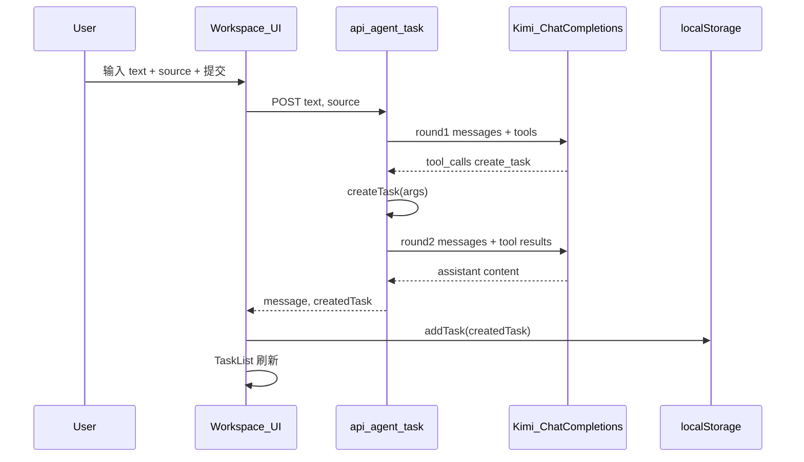

# Week 4 — AI Workspace Lite Alpha 实现计划

## 现状与差距


| 需求（[docs/week-04/README.md](docs/week-04/README.md)） | 当前仓库                                                            |
| ---------------------------------------------------- | --------------------------------------------------------------- |
| 首页为三功能入口卡片                                           | `[src/app/page.tsx](src/app/page.tsx)` 仍是完整 Prompt Lab          |
| 导航含 Home / Extract / Docs / Workspace                | `[AppNav](src/components/AppNav.tsx)` 无 Home、无 Workspace        |
| `/workspace` + 任务存储 + API + 面板                       | 不存在                                                             |
| 课程示例 `openai.responses.create` + `function_call`     | 项目使用 Kimi：`[src/lib/llm.ts](src/lib/llm.ts)` 仅 Chat Completions |


**关键适配决策（与 Week 3 一致）：** 不在此周引入 OpenAI 专用 Responses API；在 `[src/app/api/agent-task/route.ts](src/app/api/agent-task/route.ts)` 内使用 **同一 `openai` 客户端** 调用 `chat.completions.create`，传入 `tools`，解析 `choices[0].message.tool_calls`，执行 `createTask`，再发第二轮消息（`assistant` + `tool`）拿到最终自然语言回复。Kimi 平台文档表明支持 OpenAI 兼容的 function/tool 调用；若某模型返回格式异常，再在复盘里记录并加容错。

**小瑕疵（实现时顺手修）：** `[src/app/page.tsx](src/app/page.tsx)` 首行存在前导空格 `" use client"`，可能导致指令无效，迁移到 `/prompt` 时一并去掉。

---

## 架构数据流（实现后）




**为何 API 不直接写 localStorage：** localStorage 仅存在于浏览器；服务端路由只能返回 `createdTask`，由客户端 `[addTask](docs/week-04/README.md)` 持久化。这是文档隐含设计与常见做法。

**可选更优路径（本周不做）：** 服务端会话/DB 持久化、SSE 流式输出、多工具并行；与文档「先别上数据库」冲突，仅作后续优化记录在复盘。

---

## 实现步骤（做什么 / 怎么做 / 为什么）

### 1. 信息架构与导航

- **做什么：** 落地「统一首页 + 三功能页 + 工作台」。
- **怎么做：**
  - 将当前首页的 Prompt Lab 整页逻辑**原样迁移**到 `[src/app/prompt/page.tsx](src/app/prompt/page.tsx)`（新建），修复 `"use client"`。
  - 新建 `[src/app/page.tsx](src/app/page.tsx)`：简洁落地页，三个 **Link 卡片** 指向 `/prompt`、`/extract`、`/docs`（文案与文档一致：Prompt Lab、Structured Extractor、Doc QA）；可再加一句引导到 `/workspace` 或仅在导航体现。
  - 更新 `[src/components/AppNav.tsx](src/components/AppNav.tsx)`：链接 `**/`（Home）**、`/prompt`、`/extract`、`/docs`、`/workspace`，标签与产品名统一为「AI Workspace Lite」层级（保留各页 H1 的 v1 字样亦可，与现有风格一致即可）。
  - 可选：更新 `[src/app/layout.tsx](src/app/layout.tsx)` 的 `metadata.description`，体现 Alpha / 工作台。
- **为什么：** 验收标准第 1 条要求从首页进入三个功能页；文档周六要求首页为三卡片，而非把 Prompt Lab 挤在根路径。
- **更好方法：** 用 `src/app/(marketing)/page.tsx` 等路由组——本周不必，目录扁平即可。

### 2. 类型与 localStorage 任务存储

- **做什么：** `[src/types/task.ts](src/types/task.ts)`、`[src/lib/task-store.ts](src/lib/task-store.ts)` 按文档 `Task` 与 `getTasks` / `saveTasks` / `addTask`。
- **怎么做：** 与 README 骨架一致；`typeof window === "undefined"` 守卫避免 RSC/SSR 误触。
- **为什么：** 无数据库前提下完成「刷新后还在」的演示闭环。
- **更好方法：** `indexedDB` 或 `localStorage` + `storage` 事件跨标签同步；本周超出范围。

### 3. 工具定义与纯函数执行

- **做什么：** `[src/tools/create-task.ts](src/tools/create-task.ts)` 返回 `Task` 对象；`[src/tools/index.ts](src/tools/index.ts)` 导出 **Chat Completions 可用的** `tools` 项。
- **怎么做：** 课程里的扁平 `type/name/parameters` 是 **Responses API** 形态。Chat Completions 需要：

```ts
{ type: "function", function: { name: "create_task", description: "...", parameters: { ... } } }
```

  在 `index.ts` 中直接导出上述结构，避免在 route 里手写两遍。`strict: true` 为 Responses 字段，Chat Completions 侧以 `parameters.additionalProperties: false` 等 JSON Schema 表达约束即可（与文档意图一致）。

- **为什么：** 与现有 `@/lib/llm` 客户端一致；避免为单一路由引入第二供应商。
- **更好方法：** 用 Zod → JSON Schema 生成工具定义，减少手写漂移；可作为小优化若时间允许。

### 4. API：`POST /api/agent-task`

- **做什么：** 接收 `{ text, source }`，校验后两轮 Kimi 调用，返回 `{ message, createdTask }` 或 `{ message, createdTask: null }`（未调用工具时）。
- **怎么做：**
  - 复用 `[openai`, `DEFAULT_MODEL](src/lib/llm.ts)` 与 `MOONSHOT_API_KEY` 检查方式（对齐 `[ask-docs](src/app/api/ask-docs/route.ts)`）。
  - **Round 1：** `messages = [system, user]`，system 与文档一致（优先在用户要待办/跟进时调用 `create_task`）；`tools: [createTaskTool]`；`tool_choice: "auto"`。
  - 读取 `choice.message.tool_calls`；若无或空，返回 `createdTask: null`，`message` 用 `message.content` 或友好提示。
  - 解析第一个 `create_task` 的 `function.arguments`（`JSON.parse` + try/catch）；**用 `source` 请求体兜底** `args.source`，与文档 sample 一致。
  - 执行 `createTask({ title, source })`（仅构造对象，**不写** localStorage）。
  - **Round 2：** `messages` 追加 `assistant`（含 `tool_calls`）与 `tool`（`tool_call_id` + `content: JSON.stringify(createdTask)`），再请求一次；最终 `message` 取 `choices[0].message.content`。
  - 若 Kimi 返回多个 `tool_calls`：本周可只处理第一个 `create_task`，其余在复盘标注为限制。
- **为什么：** 等价实现 OpenAI 文档中的「function_call → 执行 → 回传 → 最终回复」闭环。
- **更好方法：** 抽象通用 `runToolLoop`（while 直到无 tool_calls）；本周单工具单轮足够。

### 5. 工作台 UI

- **做什么：** `[src/app/workspace/page.tsx](src/app/workspace/page.tsx)`、`[src/components/AgentTaskPanel.tsx](src/components/AgentTaskPanel.tsx)`、`[src/components/TaskList.tsx](src/components/TaskList.tsx)`。
- **怎么做：**
  - `TaskList`：`useEffect` 读 `getTasks()`，支持 `status` 展示；可提供「标记完成」调用 `saveTasks`（文档未强制，但利于演示；若要保持最小实现，仅列表 + 可选删除/完成）。
  - `AgentTaskPanel`：`text`、`source`（select: extract | docs）、按钮请求 `/api/agent-task`，展示 `message`；若 `createdTask` 存在则 `addTask` 并触发列表刷新（lift state 或 callback）。
  - 样式延续现有 Tailwind：黑底主按钮、边框次按钮，与 `[extract/page.tsx](src/app/extract/page.tsx)` 一致。
- **为什么：** 满足验收 3–4（UI 触发 + 列表可见 + 刷新仍在）。

### 6. Extract / Docs「一键生成任务」

- **做什么：** 在结果区增加按钮（文档周六第三件）。
- **怎么做：**
  - **Extract：** 有 `result` 时显示「保存为任务」：`addTask(createTask({ title: 来自` summary `截断或首条 actionItems.task`, source: "extract" }))`或先`createTask`再`addTask`；给用户简短成功提示（本地 state）。
  - **Docs：** 有 `data` 时在 `DocAnswerCard` 旁或答案区下加「把结论生成任务」：`title` 用 `answer` 前 N 字或整段（注意长度上限）。
- **为什么：** 打通「分析 → 行动」无需再经过 AI，演示路径更稳；与「模型不一定会调工具」风险解耦。
- **更好方法：** 弹窗允许编辑标题后再写入；本周可省略以保持「最小」。

### 7. 收尾文档（按技能）

- **做什么：** 实现完成后执行 `[.cursor/skills/docs-week-implementation-review/SKILL.md](.cursor/skills/docs-week-implementation-review/SKILL.md)`：
  - 新建/更新 `[docs/week-04/IMPLEMENTATION_REVIEW.md](docs/week-04/IMPLEMENTATION_REVIEW.md)`（对照 Week 4 README，表格写清：**Responses API vs 本仓库 Kimi 两轮 Chat**、文件路径、与课程差异、失败案例建议、可优化点）。
  - 在根 `[README.md](README.md)` 按 Week 01–03 **相同格式**增加 **Week 04** 两行链接。
- **为什么：** 与用户规则及技能一致，便于课程交接。

### 8. 自检（对应验收 5 条）

1. 首页可进入 `/prompt`、`/extract`、`/docs`（及导航 Workspace）。
2. `/extract`、`/docs` 行为不因移动首页而破坏（API 未改逻辑，仅加按钮）。
3. `/workspace` 可触发 AI 创建任务（依赖 `MOONSHOT_API_KEY`）。
4. 任务列表 `localStorage` 持久化。
5. Demo 脚本按文档顺序可走通（实现阶段完成后由你本地录屏）。

---

## 方案可优化点（汇总）

- **供应商：** 若需与课程字节级一致，可另设 `OPENAI_API_KEY` 仅给 `responses.create`；代价是双配置与维护两套路径。
- **健壮性：** 对 `tool_calls` 做 Zod 校验；对无工具调用返回做重试或更强 system prompt（文档「最容易卡住」第 1 点）。
- **产品：** 任务编辑、完成态筛选、从 Workspace 深链回 Extract/Docs。
- **工程：** `runToolLoop` 泛化、E2E 测试（Playwright）对 `/api/agent-task` mock。

---

## 主要新增/修改文件清单


| 路径                                                                                                        | 动作                |
| --------------------------------------------------------------------------------------------------------- | ----------------- |
| `[src/app/prompt/page.tsx](src/app/prompt/page.tsx)`                                                      | 新建（Prompt Lab 迁入） |
| `[src/app/page.tsx](src/app/page.tsx)`                                                                    | 替换为首页三卡片          |
| `[src/app/workspace/page.tsx](src/app/workspace/page.tsx)`                                                | 新建                |
| `[src/components/AppNav.tsx](src/components/AppNav.tsx)`                                                  | 更新链接              |
| `[src/types/task.ts](src/types/task.ts)`                                                                  | 新建                |
| `[src/lib/task-store.ts](src/lib/task-store.ts)`                                                          | 新建                |
| `[src/tools/create-task.ts](src/tools/create-task.ts)`                                                    | 新建                |
| `[src/tools/index.ts](src/tools/index.ts)`                                                                | 新建                |
| `[src/app/api/agent-task/route.ts](src/app/api/agent-task/route.ts)`                                      | 新建                |
| `[src/components/AgentTaskPanel.tsx](src/components/AgentTaskPanel.tsx)`                                  | 新建                |
| `[src/components/TaskList.tsx](src/components/TaskList.tsx)`                                              | 新建                |
| `[src/app/extract/page.tsx](src/app/extract/page.tsx)` / `[src/app/docs/page.tsx](src/app/docs/page.tsx)` | 加「保存为任务」类按钮       |
| `[docs/week-04/IMPLEMENTATION_REVIEW.md](docs/week-04/IMPLEMENTATION_REVIEW.md)`                          | 新建                |
| `[README.md](README.md)`                                                                                  | 追加 Week 4 区块      |


