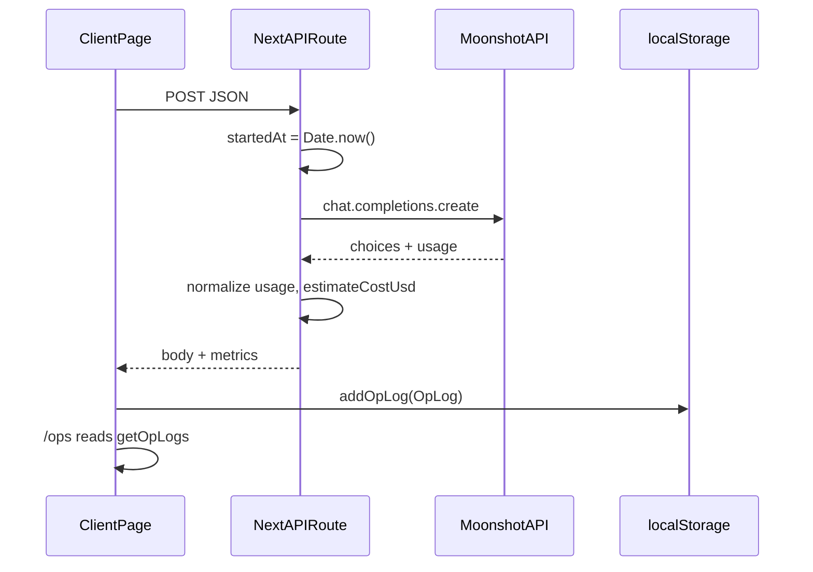

# Week 7 Ops Lite v1 实施计划

## 现状与文档差异（必须先对齐）

| 文档假设                                                  | 本仓库实际                                                                                                                     | 实现策略                                                                                                                                                                         |
| ----------------------------------------------------- | ------------------------------------------------------------------------------------------------------------------------- | ---------------------------------------------------------------------------------------------------------------------------------------------------------------------------- |
| OpenAI Responses API，`input_tokens` / `output_tokens` | [src/lib/llm.ts](src/lib/llm.ts) 使用 **Chat Completions**，`usage` 为 `prompt_tokens` / `completion_tokens` / `total_tokens` | 在服务端用 **同一套 metrics 形状**（`inputTokens` 等）做字段映射，对前端与 `OpLog` 透明                                                                                                               |
| `ask-docs` 用 `file_search`，统计 `file_search_call`      | [src/app/api/ask-docs/route.ts](src/app/api/ask-docs/route.ts) 为 **本地 `loadDocuments` + system 长上下文**                     | `usedFileSearch` 固定为 `**false`**；在 [docs/ops-week7.md](docs/ops-week7.md) 写明「本项目的 docs 路由等价于长上下文 RAG，非 OpenAI file_search」，`fileSearchCalls` 不参与成本（为 0）                      |
| 成本表以 `gpt-5-mini` 为例                                  | `DEFAULT_MODEL` 为 `kimi-k2.5`（可 `MOONSHOT_MODEL` 覆盖）                                                                      | [src/lib/cost.ts](src/lib/cost.ts) 以 **当前默认 Kimi 模型**为主定价表，并注明以 [Moonshot 官方定价](https://platform.moonshot.cn/docs/pricing) 为准、可随官网更新；未知模型时 `estimatedCostUsd === 0`（与文档骨架一致） |

**为什么这样做：** 验收标准关心的是「可观测性闭环」（usage、延迟、成本估算、对比实验），而不是绑定某一云厂商 API 形态；硬套 Responses 字段会在本仓库里拿不到数据。

---

## 架构数据流

---

## 1. 类型与共享 metrics 形状

**新增** [src/types/op-log.ts](src/types/op-log.ts)：按 [docs/week-07/README.md](docs/week-07/README.md) 的 `OpLog` 定义（含 `cachedTokens?`、`notes?`）。

**新增（推荐）** [src/types/api-metrics.ts](src/types/api-metrics.ts)（或等价命名）：定义三路由 JSON 里共用的 `metrics` 对象类型，例如：

- `inputTokens`, `outputTokens`, `totalTokens`, `cachedTokens`
- `latencyMs`, `estimatedCostUsd`
- `usedFileSearch`, `usedFunctionTool`
- 可选：`fileSearchCalls`（恒为 0，便于将来接真 file_search 时扩展）

**为什么单独类型文件：** 避免在三个 route 与三个页面里重复手写交叉类型，减少漏字段。

---

## 2. Usage 归一化（Chat Completions）

**新增**小工具函数（例如 [src/lib/chat-usage.ts](src/lib/chat-usage.ts)）：

- 输入：`completion.usage`（OpenAI SDK 的 `CompletionUsage`）
- 输出：`inputTokens = prompt_tokens`，`outputTokens = completion_tokens`，`totalTokens = total_tokens ?? input+output`
- `cachedTokens`：读取 `usage.prompt_tokens_details?.cached_tokens`（有则用之，无则 0；与 Moonshot 是否返回有关）

**新增** `addNormalizedUsage(a, b)`：供 [src/app/api/agent-task/route.ts](src/app/api/agent-task/route.ts) 在 **两次** `chat.completions.create` 时合并 token。

**为什么：** `agent-task` 在触发工具时会发第二轮请求；单次 HTTP 请求的「成本与 token」应对用户有意义地 **累加两轮**，延迟用 **整段路由 wall time**（`Date.now()` 包裹整个 handler 内 LLM 部分即可）。

**更好方案（后续）：** 若需排障，可在 `metrics` 里加 `rounds: 1 | 2` 或 `perRoundUsage`；本周保持最小字段集即可。

---

## 3. 成本估算 `cost.ts`

**新增** [src/lib/cost.ts](src/lib/cost.ts)：沿用文档中的公式结构（非缓存输入、缓存输入、输出、`fileSearchCalls * 2.5/1000`），但：

- `MODEL_PRICING` 至少包含默认模型 `**kimi-k2.5`**（单价从官网核对后写入，代码注释链到官网）
- 可保留文档中的 `gpt-5-mini` 条目作为 **对照/教学** 或删除（二选一；建议保留注释说明「课程文档示例」以免混淆）

**为什么 `fileSearchCalls` 仍保留：** 类型与公式与未来扩展一致；当前恒 0。

**可优化：** 用环境变量注入 JSON 定价（例如 `OPS_PRICING_JSON`），便于不改代码换价；本周可选，非必须。

---

## 4. 改造 `extractStructuredJson` 以暴露 usage

**修改** [src/lib/llm.ts](src/lib/llm.ts)：`extractStructuredJson` 改为返回 `**{ content: string; usage: CompletionUsage | undefined; model: string }`**（或 `null` usage 时给 0）。

**修改** [src/app/api/extract/route.ts](src/app/api/extract/route.ts)：在调用前后打时间戳；校验成功后 `NextResponse.json` 增加 `metrics`（`usedFileSearch: false`, `usedFunctionTool: false`）。

**为什么：** 当前只返回字符串，route 层无法读取 token。

---

## 5. 三 API 路由统一返回 `metrics`

| 文件                                                                 | 要点                                                                                                                                |
| ------------------------------------------------------------------ | --------------------------------------------------------------------------------------------------------------------------------- |
| [src/app/api/extract/route.ts](src/app/api/extract/route.ts)       | 使用新返回值中的 `usage`；`latencyMs` 仅覆盖 LLM 调用段（与安全预检分离，更符合「模型耗时」；若希望含预检，可改为从 `POST` 入口计时——建议在 `metrics` 内只算 **OpenAI 调用区间**，与课程「慢在哪」一致） |
| [src/app/api/ask-docs/route.ts](src/app/api/ask-docs/route.ts)     | 单次 completion；`usedFileSearch: false`；其余同上                                                                                        |
| [src/app/api/agent-task/route.ts](src/app/api/agent-task/route.ts) | 有工具：合并两轮 `usage`；`usedFunctionTool: toolCalls.length > 0`；无工具提前返回时也要带 **第一轮** `metrics`；**别忘了** 当前无工具分支未返回 `model`，应一并补齐以便日志一致    |

三处均在成功响应体中带：`model`（实际使用的模型 id）与 `metrics`。

**错误响应：** 本周可不写 op log（无 usage）；与文档「每次请求记录」不冲突——记录的是 **成功的可计费调用**。

---

## 6. 前端：`ops-store` 与三页接入

**新增** [src/lib/ops-store.ts](src/lib/ops-store.ts)：按课程骨架（`STORAGE_KEY`、`getOpLogs`、`saveOpLogs`、`addOpLog`，最多保留 50 条）。

**修改**：

- [src/app/extract/page.tsx](src/app/extract/page.tsx)
- [src/app/docs/page.tsx](src/app/docs/page.tsx)
- [src/components/AgentTaskPanel.tsx](src/components/AgentTaskPanel.tsx)

在 `fetch` 成功且解析到 `data.metrics` 后调用 `addOpLog({ id: crypto.randomUUID(), route: ... })`。

**route 字段：** 与 `OpLog` 一致使用 `"extract" | "docs" | "task"`（`agent-task` 对应 `"task"`）。

**为什么 localStorage：** 与 Week 4/课程一致，零后端存储、实现快。

**可优化：** 后续换 IndexedDB 或服务端审计表，解决多浏览器与清缓存丢失问题。

---

## 7. `/ops` 页面与导航

**新增** [src/app/ops/page.tsx](src/app/ops/page.tsx)：`"use client"`，课程中的摘要卡片 + 表格；**表格数据取 `logs.slice(0, 20)`**（满足「最近 20 条」验收，同时 store 仍可存 50）。

**修改** [src/components/AppNav.tsx](src/components/AppNav.tsx)：增加 `Ops` 链到 `/ops`。

**UI：** 延续现有 Tailwind 风格（与 [src/app/extract/page.tsx](src/app/extract/page.tsx) 等一致）。

---

## 8. 文档与根 README（课程要求部分）

- **新增** [docs/ops-week7.md](docs/ops-week7.md)：为何记 usage/latency/工具、本周不做什么、想从日志回答的问题（中文即可）。
- **新增** [docs/ops-retro-week7.md](docs/ops-retro-week7.md)：模板可先写好三节标题，**具体实验数字由你在本地跑完后填写**（计划阶段无法替你产生真实 token/latency）。
- **修改** [README.md](README.md)：追加课程提供的「Week 7 - Ops Lite v1」章节（目标 / 做了什么 / 为什么重要 / 复盘占位）。

实现收尾时若你希望与前几周一致，可再执行 [.cursor/skills/docs-week-implementation-review/SKILL.md](c:\my\ai-workspace-lite.cursor\skills\docs-week-implementation-review\SKILL.md) 更新 `docs/week-07/IMPLEMENTATION_REVIEW.md` 与根 README 链接（**仅当你确认要完成该 skill 流程时**）。

---

## 9. 「小模型 vs 默认模型」对比实验（周六标准）

**做法（与本仓库一致）：**

1. 在 `.env.local` 中准备两个 `MOONSHOT_MODEL`（例如官方提供的较轻型号与当前默认），分别重启 dev，对 **extract / docs / task** 各跑若干次（课程建议每类 3 次）。
2. 打开 `/ops` 对比：平均 `latencyMs`、`estimatedCostUsd`、`totalTokens`。
3. 从数据写一句结论：哪类场景继续用默认、哪类可试更轻模型（对应课程第 10 条验收）。

**可选代码辅助（推荐最小改动）：** 在 extract 路由或 `extractStructuredJson` 的 `options` 中已支持 `model` 时，可加 **仅开发用的** query/body 字段覆盖模型（默认关闭或仅 `NODE_ENV===development'`）；若不想改 API，仅靠改环境变量也足够满足实验。

**更好方法：** 正式产品用 **配置中心 + 按路由默认模型**；本周不必上。

---

## 10. 可选优化（本周之后）

- **服务端持久化** 或 **导出 CSV**：便于分享与长期趋势。
- **Moderation 耗时** 单独字段：当前 [src/lib/safety.ts](src/lib/safety.ts) 可能增加尾部延迟，若需可归入 `metrics.preCheckMs`。
- **定价配置化**：避免每次调价改代码。
- **Eval  harness**：若 [evals](evals) 脚本直接打 API，可解析 `metrics` 自动汇总进报告（扩展 Week 5）。

---

## 实施顺序建议

1. `op-log` 类型 + `chat-usage` + `cost.ts` + `ops-store.ts`
2. 改 `llm.ts` + `extract` → 再 `ask-docs` → 再 `agent-task`（最复杂）
3. 三处客户端 `addOpLog` + `/ops` + `AppNav`
4. `docs/ops-week7.md`、根 README Week 7、`ops-retro-week7.md` 骨架
5. 本地跑实验，填满复盘与 README 中的「最慢/最贵/优化」占位

---

## 你在实现阶段可要求的「逐步说明」格式

每完成一步可按：**做了什么 → 具体改动文件/函数 → 为什么 → 是否有更优替代** 记录（可直接贴在 PR 描述或复盘里）；本计划已预先标出「为什么」与「可优化」对应关系，实施时按需展开即可。