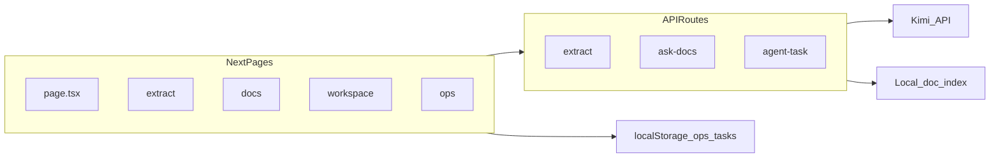

# Week 8 — AI Workspace Lite Beta（Portfolio Edition）实施计划

## 范围与原则

- **做什么**：满足 Week 8 验收的 8 条（完整 README、叙事、架构图、eval 与优化对比、安全/审批展示、成本延迟、2–3 篇 postmortem、可讲完的 Demo 路径）。
- **不做什么**（与需求文档一致）：不重构目录、不换栈、不加 MCP/realtime 等大功能。
- **技术事实**（写文档时必须对齐代码，避免与课程「OpenAI Responses」表述冲突）：本仓库主链路为 **Kimi Chat Completions** + 本地文档拼进 `ask-docs`；Ops 里 `fileSearchCalls` 等字段存在但与真实 OpenAI `file_search` 不同——在架构图与 README 的「模型与栈」小节中写清楚，避免作品集被质疑。

## 交付物与文件映射

| 需求文档要求 | 建议落点 |
|-------------|----------|
| 周一盘点 | [docs/week8-inventory.md](docs/week8-inventory.md)（5 段：页面 / 接口 / 能力 / 不稳定点 / 本周不做） |
| README 作品集结构 | 扩展 [README.md](README.md)：What / Why / Features / System design / Eval / Safety / Cost / Failures / Roadmap；保留精简「快速开始」并链到现有 `.env.example` |
| 架构图 + 数据流 | [docs/architecture-overview.md](docs/architecture-overview.md) 内嵌 **Mermaid**（GitHub 可直接渲染）；可选在 [assets/](assets/) 放导出 PNG（若你本地导出，仓库只提交图；无图则 README 链到 Mermaid 文档即可） |
| 评测摘要 | [docs/benchmark-summary.md](docs/benchmark-summary.md)（Eval harness、安全 eval、Ops 观察、**一次**优化前后对比——对比可来自真实两次 `npm run eval` 报告 diff，或引用 [docs/week-05/IMPLEMENTATION_REVIEW.md](docs/week-05/IMPLEMENTATION_REVIEW.md) / prompt 调整说明；需注明「可复现命令」） |
| 失败复盘 | [docs/postmortems/retrieval-miss.md](docs/postmortems/retrieval-miss.md)、[tool-not-called.md](docs/postmortems/tool-not-called.md)、[approval-boundary.md](docs/postmortems/approval-boundary.md)（按文档给定模板） |
| Demo / 简历 | [docs/demo-script.md](docs/demo-script.md)（3–5 分钟口播顺序）；[docs/resume-and-interview.md](docs/resume-and-interview.md)（简历 3–4 行 + 面试一页摘要）；根 README 可各给一行链接 |
| Week 8 说明块 | 在根 README 末尾增加「Week 8 - Portfolio Packaging」小节（需求文档已有模板） |
| 文档索引 | 补齐 [docs/README.md](docs/README.md)：Week 04–08 与复盘链接（当前仅到 Week 03，与根 README 不一致） |

## 轻量代码改动（仅当文档不够展示时）

- **[src/app/page.tsx](src/app/page.tsx)**：需求文档周六建议首页增加能力露出。当前仅有 Prompt Lab / Extract / Doc QA；建议增加 **Workspace**（审批式任务）、**Ops**（成本/延迟）两张卡片，并把副标题微调为「Beta / Portfolio」叙事一句。改动面小、符合「不美化整站、只补表达」。

## 实施顺序（对应「每天」可合并执行）

1. **盘点**：通读现有页面与 API（[`src/app`](src/app) 下 `extract` / `docs` / `workspace` / `ops` / `prompt`），列出 [`src/app/api`](src/app/api) 路由，写入 `week8-inventory.md` 与一句对外叙事。
2. **README 主体**：先搭 8+ 章节标题与链接骨架，再填内容；详细表格与长引用链到 `docs/benchmark-summary.md`、`docs/architecture-overview.md`、`docs/postmortems/`。
3. **架构与数据流**：在 `architecture-overview.md` 画两张 Mermaid 图——**图 1** 含 Next.js 页面、API routes、localStorage、LLM、本地 doc 索引、function tool、eval 脚本、ops logs；**图 2** 三条流：Extract / Docs QA / Task approval（与 [`src/app/api/extract/route.ts`](src/app/api/extract/route.ts)、[`ask-docs`](src/app/api/ask-docs/route.ts)、[`agent-task`](src/app/api/agent-task/route.ts) 一致）。
4. **benchmark-summary**：摘录 [evals/reports/report_security_v1.md](evals/reports/report_security_v1.md) 要点；主 eval 若仓库中尚无 [evals/reports/report_v1.md](evals/reports/report_v1.md)，在文档中写「运行 `npm run eval` 生成」并可选提交**一次**快照报告入仓（便于克隆即看）；优化对比优先用真实两次运行或引用 Week 5 复盘中的 grader/prompt 调整叙事。
5. **Postmortems**：三篇基于真实或典型场景（检索不到、工具未调用、审批边界），与 [src/lib/safety.ts](src/lib/safety.ts)、[`AgentTaskPanel`](src/components/AgentTaskPanel.tsx) 等行为一致。
6. **Demo / 简历 / 面试**：按 Week 8 Demo 脚本顺序写 `demo-script.md`；路径中 **安全样本** 写正确路径 [`evals/datasets/security_cases_v1.jsonl`](evals/datasets/security_cases_v1.jsonl)（需求文档里根路径文件名易误导）。
7. **首页卡片 + 文档索引 + 最终通读**：检查所有链接、与 `.env.example` 一致；根 README 与 `docs/README.md` 同步。

## 每一步的「说明」模板（你确认计划后，实际实现时我会按此写进 PR/提交说明或对话）

对**每个**主要交付文件，按你的要求说明四件事：

- **做了什么**：交付物与验收点对应关系。
- **怎么做**：信息来源（读哪些文件、是否运行 eval）、结构（章节/Mermaid/模板字段）。
- **为什么**：作品集读者（面试官）最关心可复现、诚实边界、失败与修复。
- **是否有更好方法**：见下方「方案可优化点」。

## 方案可优化点（整体层面）

- **图**：Mermaid 单源维护、版本可控、免设计工具；若需「海报级」视觉，再用 Figma/draw.io 导出 PNG 到 `assets/`，代价是双源需手动同步。
- **评测报告是否进 Git**：提交 `report_v1.md` 快照便于「零运行浏览」，但会过期；替代是只写 `benchmark-summary.md` + CI 或 `npm run eval` 说明——折中：**摘要进文档 + 可选提交一次 baseline 报告**。
- **README 长度**：根 README 保持概览 + 链接，长表与 case study 放 `docs/`，避免需求文档里说的「全堆进 README」。
- **IMPLEMENTATION_REVIEW**：若你希望与其它 Week 一致，可在实现完成后按 [.cursor/skills/docs-week-implementation-review/SKILL.md](.cursor/skills/docs-week-implementation-review/SKILL.md) 增加 `docs/week-08/IMPLEMENTATION_REVIEW.md` 并在根 README 增加 Week 08 链接（Week 8 以文档为主，复盘可很短）。

## 风险与依赖

- **Demo 视频**：仓库内只提供脚本与清单；录制由你在本地完成。
- **优化前后对比**：若无保存历史报告，第一次实现可用「基线 vs 当前」跑一次 eval 生成两段摘要写入 `benchmark-summary.md`（需在实现阶段实际跑通 dev + eval）。

（正式实施时会在 `architecture-overview.md` 中扩展为完整组件与三条数据流。）
